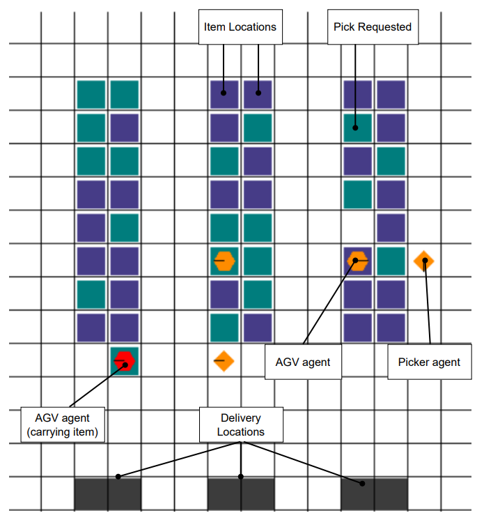

## References and Citations

### TARWare Environment

This implementation uses the TARWare (Task Allocation Robotic Warehouse) environment. 

https://github.com/uoe-agents/task-assignment-robotic-warehouse

TARWare is an extension of warehouse simulation environments for reinforcement learning. The original repository would contain additional information, licensing details, and proper citation guidelines.

# HSEAC vs SEAC: TARWare Reinforcement Learning Framework

## Table of Contents
1. [Introduction](#introduction)
2. [System Requirements](#system-requirements)
3. [Code Structure](#code-structure)
4. [Algorithm Overview](#algorithm-overview)
5. [Environment Overview](#environment-overview)
6. [Training Guide](#training-guide)
7. [Evaluation Guide](#evaluation-guide)
8. [Visualization Guide](#visualization-guide)
9. [Comparison Guide](#comparison-guide)
10. [Customization Options](#customization-options)
11. [Output Files and Results](#output-files-and-results)
12. [Troubleshooting](#troubleshooting)

## Introduction

This framework implements and evaluates two multi-agent reinforcement learning algorithms in a robotic warehouse environment called TARWare:

1. **HSEAC (Hierarchical Shared Experience Actor-Critic)**: A hierarchical approach with manager and worker networks, where the manager assigns goals (zones) to worker agents, and workers execute actions to achieve these goals.

2. **SEAC (Equalized Shared Experience Actor-Critic)**: A flat architecture without hierarchy, where agents learn independently but share experiences.

The codebase provides tools for training, evaluation, visualization, and comparison of these algorithms.

## System Requirements

### Dependencies
- Python 3.12.10
- PyTorch
- Gymnasium
- NumPy
- Matplotlib
- NetworkX
- TensorBoard (for logging)
- Pyglet (for visualization)

### Installation
```bash
pip install torch numpy gymnasium matplotlib networkx tensorboard pyglet
```

## Code Structure

The codebase consists of the following key files:

1. **Algorithm Implementations**:
   - `hseac_tarware.py`: Implementation of the HSEAC algorithm
   - `seac_tarware.py`: Implementation of the SEAC algorithm

2. **Training Scripts**:
   - `train_hseac_tarware.py`: Script to train HSEAC models
   - `train_seac_tarware.py`: Script to train SEAC models

3. **Evaluation and Visualization**:
   - `fixed_simple_evaluation.py`: Main script for comparing HSEAC and SEAC
   - `visualize_hseac_tarware.py`: Script for visualizing trained HSEAC agents

4. **Environment**:
   - `warehouse.py`: Core environment implementation
   - `definitions.py`: Environment constants and enums
   - `custom_astar.py`: Pathfinding algorithm for agents
   - `rendering.py`: Visualization of the environment
   - `spaces/`: Observation space definitions
   - `utils/`: Utility functions

## Algorithm Overview

### HSEAC (Hierarchical Shared Experience Actor-Critic)
- **Architecture**: Two-level hierarchy with a manager network and worker networks
- **Manager**: Assigns goals (zones) to agents based on global state
- **Workers**: Execute actions to achieve assigned goals
- **Experience Sharing**: Workers share experiences with similar goals

### SEAC (Equalized Shared Experience Actor-Critic)
- **Architecture**: Flat actor-critic networks for each agent
- **Policy**: Each agent selects actions directly based on observations
- **Experience Sharing**: Agents share experiences with importance sampling

## Environment Overview

TARWare simulates a warehouse with:
- **AGVs (Automated Guided Vehicles)**: Transport shelves
- **Pickers**: Assist AGVs in loading/unloading shelves
- **Shelves**: Need to be delivered to goal locations
- **Goals**: Delivery stations where shelves are needed

The environment rewards agents for:
- Picking up requested shelves
- Delivering shelves to goals
- Returning shelves to storage locations

<div style="text-align: center;">
   
</div>

*In the warehouse layout above: Dark blue and teal squares represent shelf locations, gray squares are delivery locations, orange circles are AGV agents, orange diamonds are picker agents, and red circles represent AGVs carrying items. The black lines in the shelves represent pick requests.*

## Training Guide

### Training HSEAC

You can use the full command to explicitly specify all parameters:

```bash
python train_hseac_tarware.py --train --env_name tarware-tiny-3agvs-2pickers-globalobs-v1 --n_episodes 10000 --max_steps 500 --gamma 0.99 --manager_lr 3e-4 --worker_lr 3e-4 --ent_coef 0.01 --lambda_coef 1.0 --goal_completion_steps 20 --exp_name hseac_test --render
```

Or use a simplified command that relies on default parameter values:

```bash
python train_hseac_tarware.py --env_name tarware-tiny-3agvs-2pickers-globalobs-v1 --n_episodes 10000 --train
```

### Training SEAC

Full command with explicit parameters:

```bash
python train_seac_tarware.py --train --env_name tarware-tiny-3agvs-2pickers-globalobs-v1 --n_episodes 10000 --max_steps 500 --gamma 0.99 --lr 3e-4 --ent_coef 0.01 --lambda_coef 1.0 --exp_name seac_test --render
```

Simplified command using defaults:

```bash
python train_seac_tarware.py --env_name tarware-tiny-3agvs-2pickers-globalobs-v1 --n_episodes 10000 --train
```

### Key Training Parameters

You can modify these parameters either through command-line arguments or by directly changing the default values in the code:

| Parameter | Description | Default |
|-----------|-------------|---------|
| `--env_name` | Environment name | tarware-tiny-3agvs-2pickers-globalobs-v1 |
| `--n_episodes` | Number of training episodes | 1000 |
| `--max_steps` | Maximum steps per episode | 500 |
| `--gamma` | Discount factor | 0.99 |
| `--manager_lr` | Learning rate for HSEAC manager | 3e-4 |
| `--worker_lr` | Learning rate for HSEAC workers | 3e-4 |
| `--lr` | Learning rate for SEAC | 3e-4 |
| `--ent_coef` | Entropy coefficient | 0.01 |
| `--lambda_coef` | Experience sharing coefficient | 1.0 |
| `--goal_completion_steps` | Max steps before goal completion (HSEAC) | 20 |
| `--exp_name` | Experiment name | auto-generated |
| `--render` | Enable rendering during training | False |

When using the simplified command syntax, all unspecified parameters will use these default values. For frequent experimentation with different hyperparameters, you may find it more convenient to modify the defaults in the source code rather than typing out all parameters in each command.

### Where Models Are Saved

Models are saved to:
- `models/{exp_name}/final_model/`: Final model after training
- `models/{exp_name}/checkpoints/`: Intermediate checkpoints (every 100 episodes)
- `runs/{exp_name}/`: TensorBoard logs

## Evaluation Guide

### Basic Evaluation

```bash
# Evaluate HSEAC
python train_hseac_tarware.py --evaluate --env_name tarware-tiny-3agvs-2pickers-globalobs-v1 --load_path models/hseac_test/final_model --eval_episodes 10 --render

# Evaluate SEAC
python train_seac_tarware.py --evaluate --env_name tarware-tiny-3agvs-2pickers-globalobs-v1 --load_path models/seac_test/final_model --eval_episodes 10 --render
```

### Comparative Evaluation

```bash
python fixed_simple_evaluation.py --env_name tarware-tiny-3agvs-2pickers-globalobs-v1 --hseac_model_path models/hseac_test/final_model --seac_model_path models/seac_test/final_model --num_episodes 100 --output_dir comparison_results
```

### Key Evaluation Parameters

| Parameter | Description | Default |
|-----------|-------------|---------|
| `--load_path` | Path to model | None |
| `--eval_episodes` | Number of evaluation episodes | 10 |
| `--render` | Enable rendering during evaluation | False |
| `--hseac_model_path` | Path to HSEAC model | comparison_results/models/hseac_model |
| `--seac_model_path` | Path to SEAC model | comparison_results/models/equalized_seac_model |
| `--num_episodes` | Number of episodes for comparison | 100 |
| `--output_dir` | Directory to save results | enhanced_eval_results |
| `--quiet` | Reduce terminal output | False |
| `--debug` | Enable debug output | False |

## Visualization Guide

### Visualizing HSEAC Agents

```bash
python visualize_hseac_tarware.py --env_name tarware-tiny-3agvs-2pickers-globalobs-v1 --model_path models/hseac_test/final_model --num_episodes 5 --delay 0.1
```

### Key Visualization Parameters

| Parameter | Description | Default |
|-----------|-------------|---------|
| `--model_path` | Path to trained model | Required |
| `--num_episodes` | Number of episodes to visualize | 5 |
| `--delay` | Delay between steps (seconds) | 0.1 |
| `--debug` | Enable debug mode | False |

## Comparison Guide

The `fixed_simple_evaluation.py` script provides a comprehensive comparison between HSEAC and SEAC models, including:

1. **Performance Metrics**:
   - Average returns
   - Average shelf deliveries
   - Steps per episode
   - Success rates

2. **Visualizations**:
   - Performance metrics plots
   - Deliveries per episode
   - Cumulative deliveries
   - Efficiency (steps per delivery)
   - Distribution comparisons (violin plots)
   - Joint distributions
   - Radar charts

```bash
python fixed_simple_evaluation.py --env_name tarware-tiny-3agvs-2pickers-globalobs-v1 --hseac_model_path models/hseac_test/final_model --seac_model_path models/seac_test/final_model --num_episodes 100 --output_dir comparison_results
```

## Customization Options

### Environment Customization

The TARWare environment can be customized through the environment name:
```
tarware-{size}-{num_agvs}agvs-{num_pickers}pickers-{obs_type}obs-v1
```

Where:
- `size`: tiny, small, medium, large, extralarge
- `num_agvs`: Number of AGVs (1-19)
- `num_pickers`: Number of pickers (1-9)
- `obs_type`: global, partial

Example:
```
tarware-medium-5agvs-3pickers-globalobs-v1
```

### Algorithm Hyperparameters

Both algorithms have various hyperparameters that can be adjusted:

### Action Annealing Parameters

Both HSEAC and SEAC algorithms use an annealing process to gradually transition from exploration to exploitation during training. This is controlled by the following parameters in the code:

```python
# In hseac_tarware.py and seac_tarware.py
det_action_start_prob=0.0,    # Starting probability of using deterministic actions
det_action_final_prob=0.8,    # Final probability of using deterministic actions
det_action_anneal_episodes=700,  # Episodes over which to anneal
```

These parameters can be modified in the `__init__` method of both algorithm classes:

- **det_action_start_prob**: Initial probability of selecting actions deterministically (exploitation) instead of randomly (exploration). Set to 0.0 for pure exploration at the beginning.

- **det_action_final_prob**: Final probability of selecting actions deterministically. Higher values (e.g., 0.8-0.9) favor exploitation in later training stages.

- **det_action_anneal_episodes**: Number of episodes over which to linearly transition from start_prob to final_prob. This controls how quickly the algorithm shifts from exploration to exploitation.

#### Tuning Guidelines:

- **For complex environments**: Use longer annealing periods (800-1000 episodes) to ensure sufficient exploration
- **For simpler environments**: Shorter annealing periods (400-600 episodes) may suffice
- **Exploration-heavy approach**: Lower final_prob (0.5-0.7) maintains more randomness throughout training
- **Exploitation-focused approach**: Higher final_prob (0.8-0.95) results in more deterministic behavior

The annealing schedule also affects the learning rate through schedulers that reduce the learning rate over the same period, helping stabilize learning as the policy becomes more deterministic.

## Output Files and Results

### Training Outputs

- **TensorBoard Logs**: `runs/{exp_name}/`
- **Model Checkpoints**: `models/{exp_name}/checkpoints/`
- **Final Model**: `models/{exp_name}/final_model/`
- **Learning Curves**: `models/{exp_name}/learning_curves.png`
- **Configuration**: `models/{exp_name}/config.json`

### Evaluation Outputs

- **Performance Metrics CSV**: `{output_dir}/comparison_metrics.csv`
- **Episode Data CSV**: `{output_dir}/episode_data.csv`
- **Performance Plots**:
  - `{output_dir}/performance_metrics.png`
  - `{output_dir}/deliveries_per_episode_enhanced.png`
  - `{output_dir}/cumulative_deliveries_enhanced.png`
  - `{output_dir}/steps_per_delivery_efficiency.png`
  - `{output_dir}/violin_plot_comparison.png`
  - `{output_dir}/joint_distribution_returns_deliveries.png`
  - `{output_dir}/radar_chart_comparison.png`

## Troubleshooting

### Common Issues

1. **ImportError: No module named 'tarware'**:
   - Ensure the tarware module is in your Python path

2. **CUDA out of memory**:
   - Reduce batch size or model size
   - Run on CPU by setting `device = torch.device("cpu")` in the algorithm files

3. **NaN values during training**:
   - Reduce learning rate
   - Check for gradient explosions
   - Add gradient clipping (already implemented)

4. **Environment not found**:
   - Check the environment name
   - Ensure tarware is properly installed

5. **Model loading failure**:
   - Verify the model path is correct
   - Ensure the model was fully saved
   - Check for compatibility issues if loading models trained with different versions

### Debugging

Enable debug mode to get more information:
```bash
python fixed_simple_evaluation.py --debug ...
python visualize_hseac_tarware.py --debug ...
```

For HSEAC/SEAC training, add debug flags directly in the agent initialization:
```python
agent = HSEAC(env=env, debug=True, ...)
```